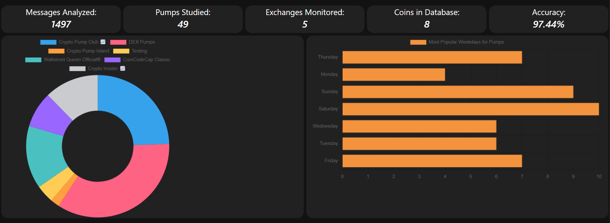

# Cryptocurrency Market Monitor

## The Problem
A pump and dump is a manipulative scheme that attempts to boost the price of a stock or security through fake recommendations. These recommendations are based on false, misleading, or greatly exaggerated statements. The perpetrators of a pump-and-dump scheme already have an established position in the company's stock and will sell their positions  after the hype has led to a higher share price ([source](https://www.investopedia.com/terms/p/pumpanddump.asp)).

## Proposed Solution
Monitoring social media forums (telegram groups for now) known for organizing pumps and matching these activities to anomalies in the price. 
This project aims to achieve the following objectives:
- <b>[Information Extraction from Telegram Messages](https://github.com/Anuraag20/pnd-telegram-monitoring)</b>: Detecting the schedule of the pumps by monitoring Telegram channels.
- <b>[Time Series Anomaly Detection](https://colab.research.google.com/drive/1PcP7A7uGZQ1Jui8zO18rkePBFW4vd23J#scrollTo=OEvk-iV4jI_t)</b>: Training and testing various anomaly detection models and deploying the best one for confirmation of anomalous behaviour in the market.  
- <b>Attributing Anomalies to Groups that Organized them</b>: Comparing the times of the scheduled PNDs to the anomalies detected through Time-Series analysis. 
- <b>[Web Application](https://pndtracker.anuraag.tech)</b>: Creating web-application for viewing the collected data and monitoring the pumps in real time.  
- <b>Visualizing the Data</b>: Adding visualizations to the application to provide insights about 
the pumps to the end user. 

## Detailed Report
This project was done as a part of my masters. The full project report can be found [here](https://anuraag.tech/media/msc-project-report.pdf).

## Running the application
The dockerized version of the application along with instructions to run the same can be found [here](https://github.com/Anuraag20/pndtracker).
